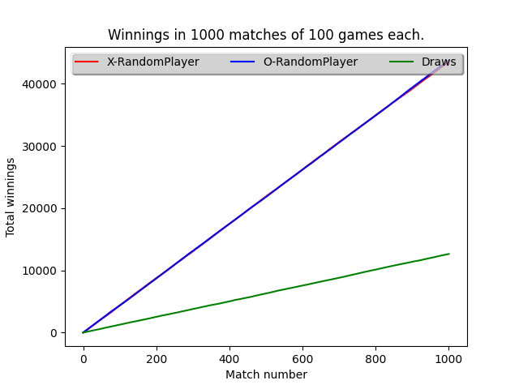
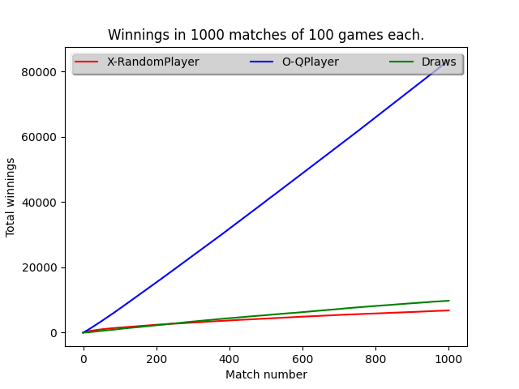
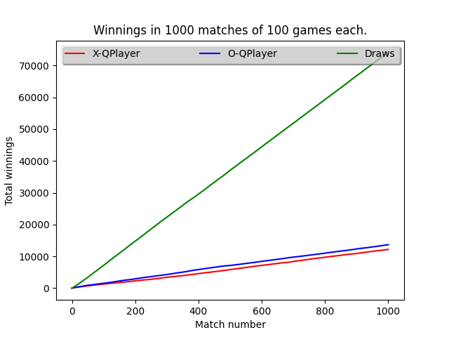

# tictactoe-ai

Tic Tac Toe game that can be played between bot vs bot, human vs bot or human vs human.

There are two implementations for bot players: `RandomPlayer` and `QPlayer`, the last plays using a Q-Learning algorithm.

## Results

All the results are from 1000 matches of 100 games each, the start player was selected randomly. Where is involved a `QPlayer` it started from scratch to learn.

1. `RandomPlayer` vs `RandomPlayer`.
   
   

2. `RandomPlayer` vs `QPlayer`.
   
   

3. `QPlayer` vs `QPlayer`.

   

4. As an exception in this case `QPlayer` instances used pre-trained sets, so they had previous knowledge when started to play.

   

## Playing vs AI

If you want to play vs a bot, it will be a `QPlayer` and will load a pre-trained set of states conveniently.

## Requirements

The project was developed using `python 3.8.5` and the requirements are listed in `requirements.txt`.

## Running the code

```cmd
usage: main.py [-h] [-x X] [-o O]

optional arguments:
  -h, --help  show this help message and exit
  -x X        Player X type, human('h'), random('r') or q-learning('q')
  -o O        Player O type, human('h'), random('r') or q-learning('q')
```

### Example

Next instruction will start a simulation between two instances of `QPlayers` and then will plot the results.

```cmd
python3 main.py -x q -o q
```
